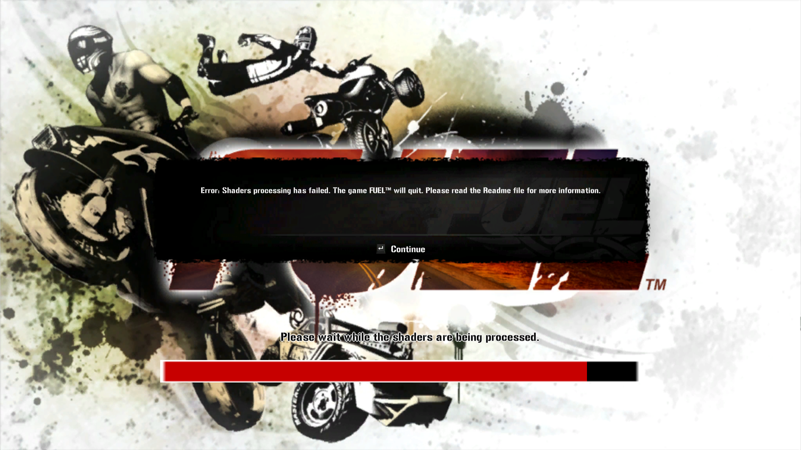
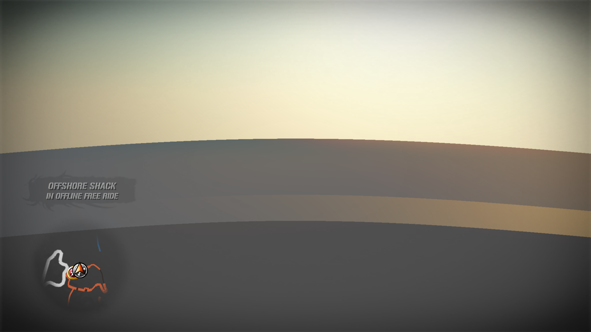
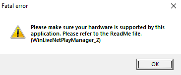
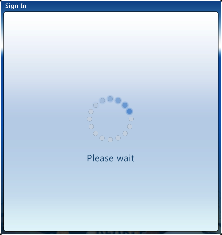

Errors
======

The Game Disc could not be read
-------------------------------

``The Game Disc could not be read.``

   
Causes:

* A game file is missing or corrupted. Likely a .DPC file.

Solutions:

* Check the output log for the error message and report it to the mod author.

Error: Shaders processing has failed
------------------------------------

``Error: Shaders processing has failed. The game FUEL™ will quit. Please read the Readme file for more information.``

   
Causes:

* A shader compiler error has occured.

Solutions:

* Check the output log for the error message and report it to the mod author.

3D Objects Don't Render
------------------------------------

   
Causes:

* Graphics Card 3D Settings

Solutions:

* For NVIDIA GPUs, open the ``NVIDIA Control Panel``. Navigate to ``3D Settings -> Manage 3D setting``. Select the ``Program Settings`` tab and select fuel as the program to customize. Under ``Specify the settings for this program``, set ``Antialiasing - Mode`` to ``Off``.
* For Intel GPUs, open the ``Intel® Graphics Command Center``. Click the ``Add Games`` button and add ``FUEL.exe``. Once added, click the new ``FUEL`` entry. Under ``DRIVER OVERRIDES``, set ``Anti-Aliasing`` to ``Always Off``.

Please make sure your hardware is supported by this application
---------------------------------------------------------------

``Please make sure your hardware is supported by this application. Please refer to the Readme file. (WinLiveNetPlayManager_Z)``

   
Causes:

* GFWL is not properly installed.

Solutions:

* Use a liveless mod.
* If you want the real GFWL then reinstalling Windows seems to fix this :(

Please wait
---------------------------------------------------------------

``Games For Windows Sign In LIVE Please wait``

   
Causes:

* GFWL is a terrible piece of software.

Solutions:

* Wait. I had to wait ~30mins the last time I had this.
